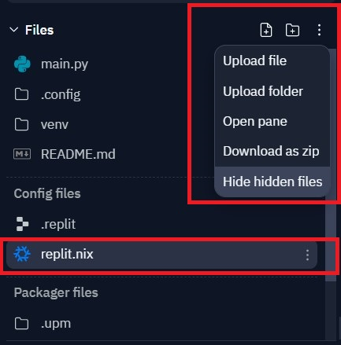
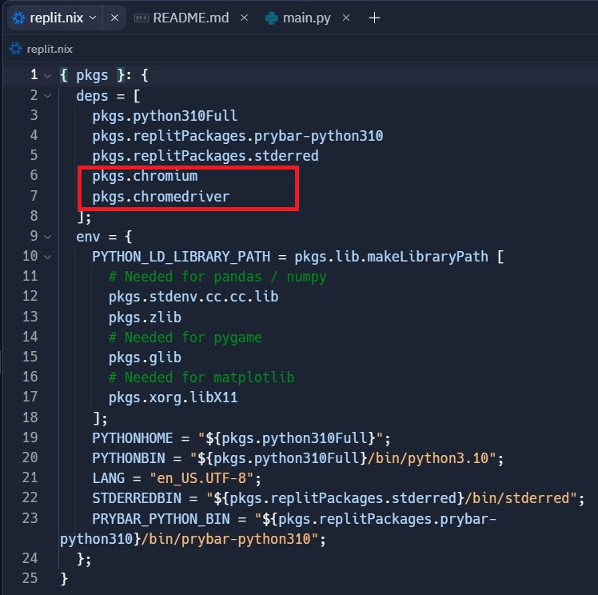
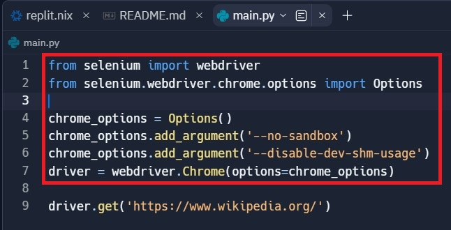
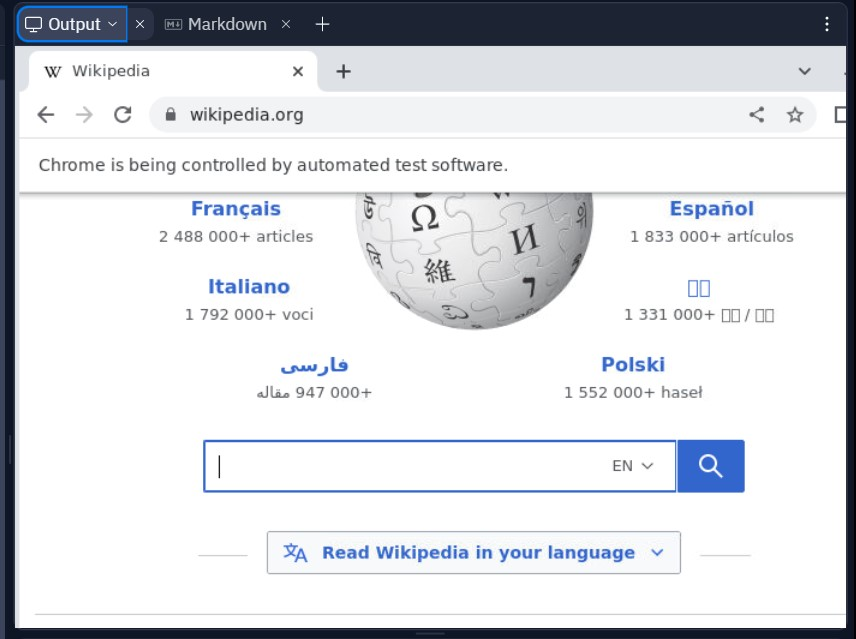

## How To Run Selenium On Replit
#### This is webscrapping project. Project running on : https://replit.com/@ViktoriusSuwand/AppBrewery-python-Day-48-Selenium-web-driver

### Technology and Features :
    * using Selenium packages
    * using no additional driver file
    * Tested on several URL websites

### Description :
#### python.org
1. Extract the Upcoming event data from the `python.org` website.
2. Use `Selenium` to scrape all upcoming event `dates` and event `names`.
3. Store `dates` and `names` into a nested `python dictionary` to the `console`.
4. The event data from `python.org` should be stored under the keys `time` and `name`.

### Setup and Configuration :
- Install Selenium using shell terminal, type `pip install selenium`
   The installation and basic command can be found on :
   https://replit.com/talk/learn/Python-Selenium-Tutorial-The-Basics/148030
  
- Open all of your hidden file

- Add packages on your `Replit.nix`

- Add Options on your `main.py`

- Show `the URL website` on the output panel

#### Project Result

