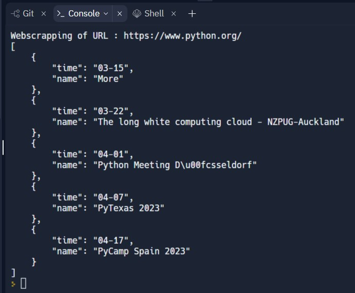
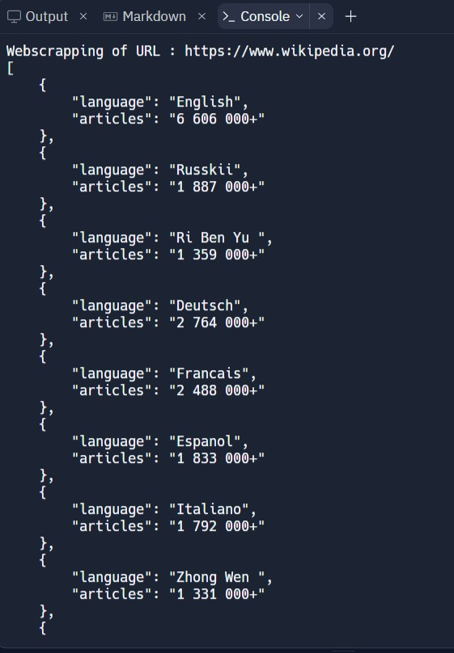

## How To Run Selenium On Replit
#### This is webscrapping project. The project running on : https://replit.com/@ViktoriusSuwand/AppBrewery-python-Day-48-Selenium-web-driver

### Technology and Features :
    * using Selenium packages
    * using no additional driver file
    * Tested on some URL websites

### Description :
#### python.org
1. Extract the Upcoming event data from the `python.org` website.
2. Use `Selenium` to scrape all upcoming event `dates` and event `names`.
3. Store `dates` and `names` into a nested `python dictionary` to the `console`.
4. The event data from `python.org` should be stored under the keys `time` and `name`.

#### wikipedia.org
##### Extract Website Data
1. Extract the articles amount of each language available from the `wikipedia.org` website.
2. Find and get all languages available and articles'samount on each language using `find multiple elements` method.
3. Create `articles` dictionary with key `language` and key `articles` for `languages` and `amount`.

##### Search Some Information
1. Search information about python by typing python on `search bar`.
2. Select english as output language.
3. Print all the headlines references.

### Setup and Configuration :
    1. Install Selenium using shell terminal, type `pip install selenium`.
       The installation and basic command can be found on :
       https://replit.com/talk/learn/Python-Selenium-Tutorial-The-Basics/148030
  
    2. Open all of your hidden file
  

    3. Add packages on your `Replit.nix`
  
       
    4. Add Options on your `main.py`
  

    5. Show `the URL website` on the output panel
  

# Project Result

